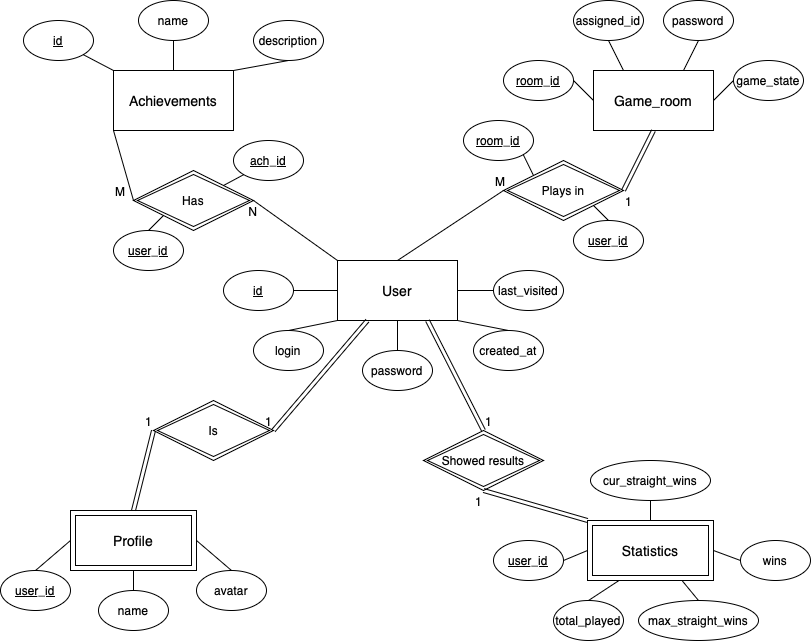

# Online-game-7Red
## Running with Docker

1. Build and start all services:
   ```sh
   docker-compose up --build
   ```

2. Access the backend at [http://localhost:8000](http://localhost:8000)

## Database Structure

